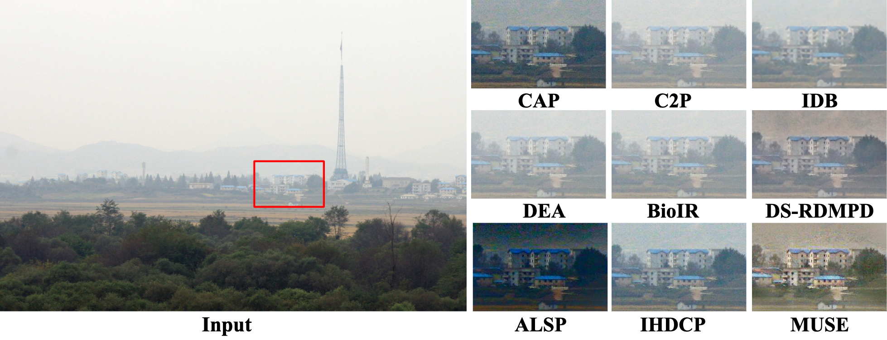
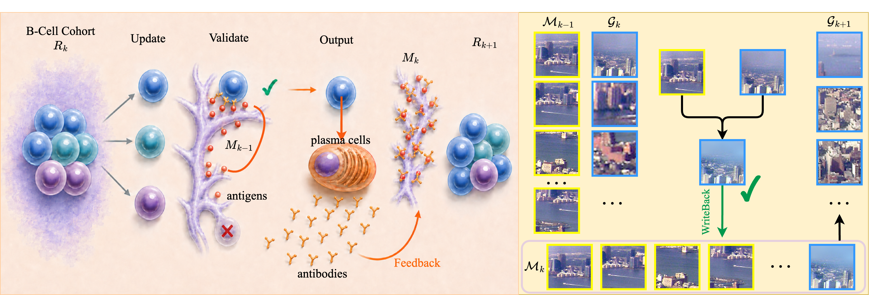
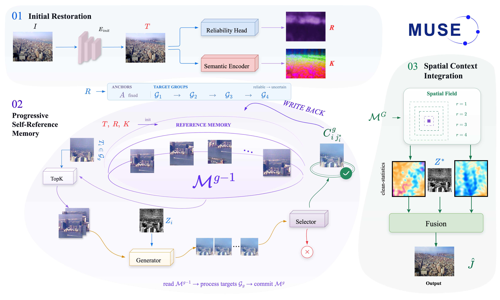
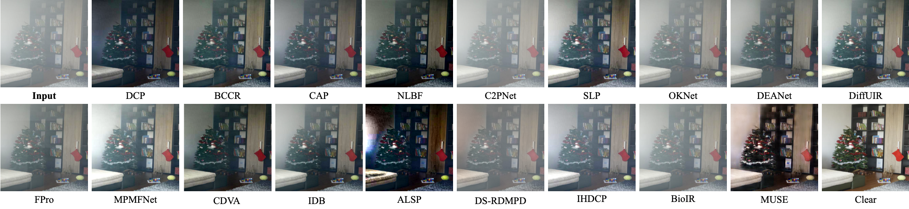
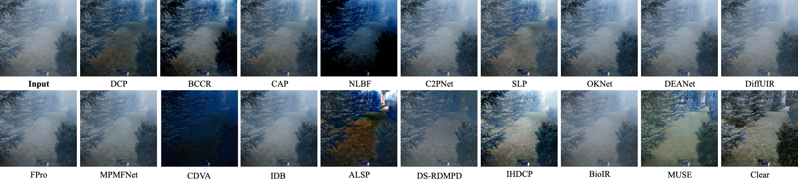
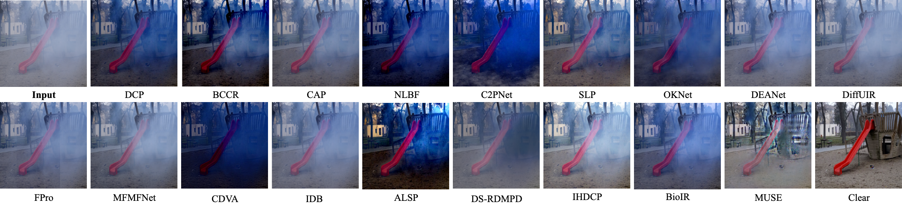
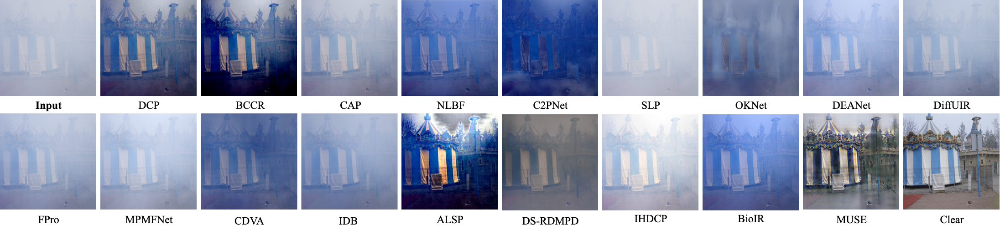
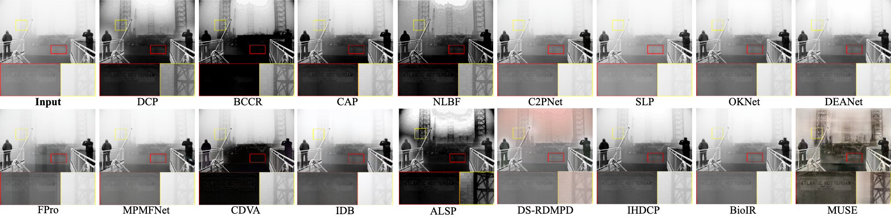
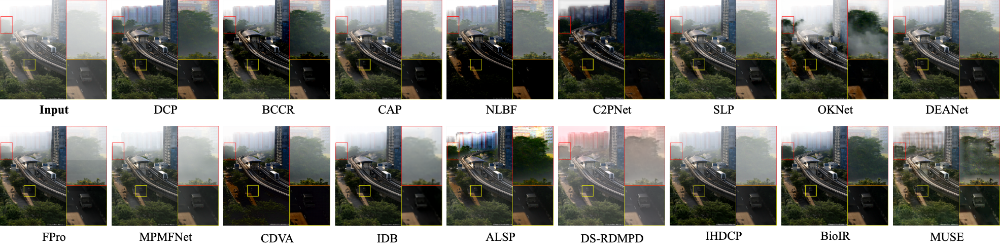
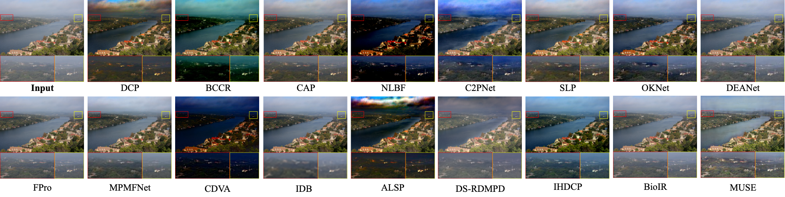

  

<h1 align="center">MUSE</h1>
<h3 align="center">Memory-Based Unified Self-Reference Evolution for Single-Image Dehazing</h3>

  <a href="#overview">Overview</a> ·
  <a href="#biological-inspiration">Inspiration</a> ·
  <a href="#framework">Framework</a> ·
  <a href="#quantitative-results">Quantitative Results</a> ·
  <a href="#visual-results">Visual Results</a> ·
  <a href="#availability">Availability</a>

  <strong>Single-Image Dehazing</strong> &nbsp; / &nbsp; Computer Vision &nbsp; / &nbsp; Image Restoration

  

<em>Selected visual comparison. Method names and the highlighted region are labeled in the figure.</em>

## Overview

**MUSE** studies single-image dehazing under challenging haze conditions, including spatially nonuniform and dense haze. The goal is to recover scene visibility while preserving image structure and a natural appearance.

This repository presents the biological inspiration, framework, quantitative comparisons, and selected qualitative results from the project. The gallery covers indoor, outdoor, nonuniform-haze, dense-haze, and real-world scenes.

## Biological Inspiration

  

<em>Biological inspiration and its computational analogy for progressive reference-memory updates.</em>

## Framework

  

<em>Overview of the MUSE framework.</em>

## Quantitative Results

Results across seven benchmark datasets are grouped below. Expand each dataset to view the full comparison. **Bold**, <ins>underlined</ins>, and *italic* values denote the best, second-best, and third-best results within each column, respectively. ↑ means higher is better; ↓ means lower is better.

### Paired datasets

<strong>I-HAZE</strong>

| Method | PSNR ↑ | SSIM ↑ | CIEDE ↓ | NIQE ↓ | NIMA ↑ |
| :--- | ---: | ---: | ---: | ---: | ---: |
| (TPAMI'11) DCP | 12.9104 | 0.6328 | 19.1885 | 4.5586 | 4.0035 |
| (ICCV'13) BCCR | 15.5514 | 0.7352 | 15.2005 | <ins>4.2014</ins> | 4.1126 |
| (TIP'15) CAP | 16.1609 | 0.7140 | 13.7226 | 4.7924 | 3.8794 |
| (TIP'20) NLBF | 11.5293 | 0.3837 | 22.1446 | 5.0681 | *4.2354* |
| (CVPR'23) C2P | 15.3023 | 0.7002 | 14.0425 | 5.2741 | 3.8681 |
| (TIP'23) SLP | <ins>17.3103</ins> | *0.7707* | 12.2764 | 4.6603 | 3.8931 |
| (AAAI'24) OKNet | 16.0326 | 0.7178 | 13.2198 | 5.2424 | 3.8720 |
| (TIP'24) DEA | 16.5081 | 0.7315 | 12.7910 | 5.0863 | 3.8626 |
| (CVPR'24) DiffUIR | 16.8517 | 0.7514 | *12.1354* | 5.0402 | 3.8948 |
| (ECCV'24) FPro | *17.1239* | 0.7459 | **11.9091** | 4.8415 | 3.9540 |
| (AAAI'25) MPMF | 16.4329 | <ins>0.7781</ins> | 12.9872 | 4.8579 | 4.1255 |
| (TIM'25) CDVA | 10.7027 | 0.3807 | 24.1564 | 4.6327 | 4.2158 |
| (TITS'25) IDB | 16.4967 | 0.6993 | 12.6967 | 6.6375 | 3.5912 |
| (TIP'25) ALSP | 11.1810 | 0.4859 | 22.3020 | **4.1063** | <ins>4.3286</ins> |
| (TGRS'25) DS-RDMPD | 15.1438 | 0.6871 | 14.6474 | 5.2348 | 3.9733 |
| (TIP'26) IHDCP | 16.5552 | 0.7548 | 13.0498 | 4.4366 | 3.8924 |
| (NeurIPS'26) BioIR | 15.6129 | 0.7102 | 13.5319 | 5.0033 | 3.8856 |
| **MUSE** | **17.5798** | **0.7824** | <ins>11.9925</ins> | *4.2223* | **4.5654** |

<strong>O-HAZE</strong>

| Method | PSNR ↑ | SSIM ↑ | CIEDE ↓ | NIQE ↓ | NIMA ↑ |
| :--- | ---: | ---: | ---: | ---: | ---: |
| (TPAMI'11) DCP | 16.3314 | 0.6686 | 17.3166 | 3.5367 | 4.5405 |
| (ICCV'13) BCCR | 15.4247 | 0.6231 | 17.8353 | 3.4904 | <ins>4.7130</ins> |
| (TIP'15) CAP | *17.0397* | *0.6787* | 14.8020 | 3.5557 | 4.3855 |
| (TIP'20) NLBF | 12.0933 | 0.3750 | 25.2960 | 3.8770 | **4.8005** |
| (CVPR'23) C2P | 14.9625 | 0.6302 | 16.9785 | 3.6919 | 4.2949 |
| (TIP'23) SLP | 16.5151 | <ins>0.7168</ins> | *14.7323* | 3.6765 | 4.3965 |
| (AAAI'24) OKNet | 15.9599 | 0.6541 | 16.3177 | 3.8030 | 4.3384 |
| (TIP'24) DEA | 15.0101 | 0.6358 | 16.9978 | 3.7136 | 4.2772 |
| (CVPR'24) DiffUIR | 15.3871 | 0.6412 | 16.8472 | 3.6178 | 4.3901 |
| (ECCV'24) FPro | 15.7767 | 0.6502 | 15.8203 | 3.4861 | 4.3664 |
| (AAAI'25) MPMF | 15.9659 | 0.6711 | 15.8331 | 3.6233 | 4.5251 |
| (TIM'25) CDVA | 11.9394 | 0.3822 | 25.7824 | 3.8962 | 4.5283 |
| (TITS'25) IDB | 16.0053 | 0.5141 | 16.4071 | 6.9108 | 3.7361 |
| (TIP'25) ALSP | 13.4410 | 0.5304 | 20.8446 | <ins>3.3991</ins> | *4.6714* |
| (TGRS'25) DS-RDMPD | <ins>17.5815</ins> | 0.6489 | <ins>13.7387</ins> | 3.9089 | 4.1554 |
| (TIP'26) IHDCP | 13.1249 | 0.6650 | 21.2906 | *3.4067* | 4.3448 |
| (NeurIPS'26) BioIR | 14.0063 | 0.6019 | 18.1911 | 3.5730 | 4.2719 |
| **MUSE** | **19.0449** | **0.7440** | **12.0000** | **3.3574** | 4.3930 |

<strong>NH-HAZE</strong>

| Method | PSNR ↑ | SSIM ↑ | CIEDE ↓ | NIQE ↓ | NIMA ↑ |
| :--- | ---: | ---: | ---: | ---: | ---: |
| (TPAMI'11) DCP | 12.5486 | 0.4999 | 23.7639 | 2.7323 | 5.2732 |
| (ICCV'13) BCCR | 11.6626 | 0.4475 | 24.9016 | <ins>2.4952</ins> | <ins>5.4230</ins> |
| (TIP'15) CAP | *13.1865* | 0.5124 | 20.7002 | 2.8274 | 5.1285 |
| (TIP'20) NLBF | 10.1565 | 0.3092 | 30.0082 | 2.8534 | **5.4386** |
| (CVPR'23) C2P | 10.8453 | 0.3937 | 29.2391 | 3.0087 | 5.1672 |
| (TIP'23) SLP | 12.7657 | *0.5647* | *20.6847* | 2.7119 | 5.1976 |
| (AAAI'24) OKNet | 11.7208 | 0.4158 | 25.4327 | 3.2430 | *5.3903* |
| (TIP'24) DEA | 12.4198 | 0.5312 | 21.8653 | 2.7844 | 5.0856 |
| (CVPR'24) DiffUIR | 12.0975 | 0.4758 | 21.6263 | 2.9492 | 5.0438 |
| (ECCV'24) FPro | 12.4836 | 0.5004 | 21.5556 | 2.8438 | 5.0997 |
| (AAAI'25) MPMF | 12.1692 | 0.5146 | 21.5585 | 3.0509 | 5.1435 |
| (TIM'25) CDVA | 10.0570 | 0.3153 | 31.0308 | 2.9551 | 5.0862 |
| (TITS'25) IDB | 12.2552 | 0.3500 | 21.8698 | 6.9554 | 4.1664 |
| (TIP'25) ALSP | 10.9002 | 0.4376 | 26.9171 | **2.4230** | 5.1109 |
| (TGRS'25) DS-RDMPD | <ins>14.1870</ins> | 0.4840 | <ins>18.5442</ins> | 3.3340 | 4.6830 |
| (TIP'26) IHDCP | 11.6897 | <ins>0.5659</ins> | 21.8590 | 2.6629 | 5.1820 |
| (NeurIPS'26) BioIR | 12.5431 | 0.5561 | 22.7297 | 2.7057 | 5.1602 |
| **MUSE** | **15.0974** | **0.6620** | **15.9325** | *2.6175* | 4.8911 |

<strong>Dense-HAZE</strong>

| Method | PSNR ↑ | SSIM ↑ | CIEDE ↓ | NIQE ↓ | NIMA ↑ |
| :--- | ---: | ---: | ---: | ---: | ---: |
| (TPAMI'11) DCP | *12.6676* | <ins>0.4275</ins> | 23.6449 | 5.4212 | 4.4438 |
| (ICCV'13) BCCR | 11.2050 | 0.3390 | 25.7123 | 5.0905 | <ins>4.6499</ins> |
| (TIP'15) CAP | 11.5429 | 0.4079 | *23.5937* | 6.2150 | 4.4104 |
| (TIP'20) NLBF | 11.7192 | 0.3781 | 26.2808 | 5.5650 | *4.6312* |
| (CVPR'23) C2P | 9.3815 | 0.2252 | 32.4059 | 5.3338 | 4.2397 |
| (TIP'23) SLP | 10.0816 | 0.3928 | 27.7566 | 6.5190 | 4.3470 |
| (AAAI'24) OKNet | 11.0696 | 0.2982 | 26.0911 | 7.1760 | 4.6305 |
| (TIP'24) DEA | 10.5035 | 0.4098 | 26.9221 | 5.7428 | 4.4432 |
| (CVPR'24) DiffUIR | 10.7501 | 0.3953 | 25.9398 | 6.2868 | 4.4502 |
| (ECCV'24) FPro | 11.2219 | 0.3916 | 25.0731 | 6.0903 | 4.3797 |
| (AAAI'25) MPMF | 10.3928 | 0.4149 | 26.6804 | 6.9801 | 4.6172 |
| (TIM'25) CDVA | 11.5981 | 0.3615 | 26.4065 | 5.6819 | 4.2962 |
| (TITS'25) IDB | 11.2858 | 0.3685 | 24.9101 | 9.1905 | 3.8824 |
| (TIP'25) ALSP | 6.8485 | 0.2456 | 28.7519 | **4.9177** | 4.5820 |
| (TGRS'25) DS-RDMPD | **14.0231** | 0.4027 | **18.7968** | 7.4541 | 4.0946 |
| (TIP'26) IHDCP | 8.3453 | 0.3954 | 32.6388 | 5.7044 | 4.3190 |
| (NeurIPS'26) BioIR | 11.1639 | *0.4188* | 26.3918 | <ins>5.0256</ins> | 4.4573 |
| **MUSE** | <ins>12.8196</ins> | **0.4916** | <ins>20.7605</ins> | *5.0802* | **4.9133** |

### No-reference datasets

<strong>RTTS</strong>

| Method | NIQE ↓ | NIMA ↑ | TOPIQ-NR ↑ |
| :--- | ---: | ---: | ---: |
| (TPAMI'11) DCP | *4.4897* | 4.6150 | 0.3928 |
| (ICCV'13) BCCR | 4.9060 | 4.6939 | 0.3871 |
| (TIP'15) CAP | 4.7920 | 4.6374 | 0.3971 |
| (TIP'20) NLBF | 5.5441 | 4.6777 | 0.3707 |
| (CVPR'23) C2P | 5.0631 | 4.6740 | 0.3967 |
| (TIP'23) SLP | 4.6336 | 4.6191 | 0.3985 |
| (AAAI'24) OKNet | 4.9677 | 4.6579 | 0.3984 |
| (TIP'24) DEA | 4.8316 | 4.6223 | <ins>0.4032</ins> |
| (CVPR'24) DiffUIR | 5.0212 | 4.6319 | 0.4020 |
| (ECCV'24) FPro | 4.9310 | 4.6616 | **0.4066** |
| (AAAI'25) MPMF | 4.7564 | <ins>4.7425</ins> | *0.4027* |
| (TIM'25) CDVA | 4.6462 | 4.5998 | 0.3850 |
| (TITS'25) IDB | 7.3032 | 4.2256 | 0.2678 |
| (TIP'25) ALSP | **4.2121** | *4.7253* | 0.3810 |
| (TGRS'25) DS-RDMPD | 5.0566 | 4.5995 | 0.3959 |
| (TIP'26) IHDCP | 4.6492 | 4.6635 | 0.3935 |
| (NeurIPS'26) BioIR | 4.9779 | 4.6057 | 0.4002 |
| **MUSE** | <ins>4.2717</ins> | **4.8396** | 0.4022 |

<strong>HSTS</strong>

| Method | NIQE ↓ | NIMA ↑ | TOPIQ-NR ↑ |
| :--- | ---: | ---: | ---: |
| (TPAMI'11) DCP | 4.0059 | 5.3180 | 0.3727 |
| (ICCV'13) BCCR | 4.0133 | *5.4065* | 0.3726 |
| (TIP'15) CAP | 4.0763 | 5.3125 | 0.3706 |
| (TIP'20) NLBF | 4.5776 | 5.3760 | 0.3640 |
| (CVPR'23) C2P | 4.0546 | 5.3084 | 0.3622 |
| (TIP'23) SLP | 4.0745 | <ins>5.4565</ins> | *0.3771* |
| (AAAI'24) OKNet | 4.0612 | 5.3153 | 0.3634 |
| (TIP'24) DEA | 4.1818 | 5.2541 | 0.3746 |
| (CVPR'24) DiffUIR | 7.1018 | 4.9298 | 0.2522 |
| (ECCV'24) FPro | 4.0081 | 5.3196 | **0.3819** |
| (AAAI'25) MPMF | *3.9219* | 5.2974 | 0.3720 |
| (TIM'25) CDVA | 4.1962 | 5.2610 | 0.3617 |
| (TITS'25) IDB | 6.3471 | 5.2376 | 0.2834 |
| (TIP'25) ALSP | **3.8839** | 5.2646 | 0.3684 |
| (TGRS'25) DS-RDMPD | 4.0931 | 5.1435 | 0.3733 |
| (TIP'26) IHDCP | 3.9301 | 5.2998 | 0.3747 |
| (NeurIPS'26) BioIR | 4.0547 | 5.2130 | 0.3758 |
| **MUSE** | <ins>3.9085</ins> | **5.6516** | <ins>0.3813</ins> |

<strong>FTD</strong>

| Method | NIQE ↓ | NIMA ↑ | TOPIQ-NR ↑ |
| :--- | ---: | ---: | ---: |
| (TPAMI'11) DCP | 3.6650 | 4.9042 | 0.4641 |
| (ICCV'13) BCCR | 3.8210 | *4.9515* | 0.4564 |
| (TIP'15) CAP | 3.8022 | 4.8855 | 0.4771 |
| (TIP'20) NLBF | 4.8746 | 4.8831 | 0.4299 |
| (CVPR'23) C2P | *3.5695* | 4.8927 | 0.4318 |
| (TIP'23) SLP | **3.4793** | 4.8682 | 0.4586 |
| (AAAI'24) OKNet | <ins>3.5607</ins> | 4.9440 | 0.4474 |
| (TIP'24) DEA | 3.7799 | 4.7295 | 0.4607 |
| (CVPR'24) DiffUIR | 3.9335 | 4.7266 | 0.4581 |
| (ECCV'24) FPro | 3.8773 | 4.9010 | **0.4915** |
| (AAAI'25) MPMF | 3.9997 | 4.8089 | 0.4475 |
| (TIM'25) CDVA | 4.2323 | 4.8399 | 0.4514 |
| (TITS'25) IDB | 6.7697 | 4.1168 | 0.2853 |
| (TIP'25) ALSP | 3.6706 | 4.8777 | 0.4530 |
| (TGRS'25) DS-RDMPD | 4.1433 | 4.7199 | 0.4632 |
| (TIP'26) IHDCP | 3.8467 | <ins>4.9659</ins> | 0.4764 |
| (NeurIPS'26) BioIR | 3.9236 | 4.8624 | <ins>0.4867</ins> |
| **MUSE** | 3.5999 | **5.0316** | *0.4853* |

## Visual Results

Select a dataset below to view its comparison figure. Click any figure to inspect it at full resolution. Input images, comparison methods, MUSE outputs, and clear references where available are labeled within each figure.

### Paired benchmarks

<strong>I-HAZE · Indoor scenes</strong>

 

<strong>O-HAZE · Outdoor scenes</strong>

 

<strong>NH-HAZE · Nonuniform haze</strong>

 

<strong>Dense-HAZE · Dense haze</strong>

 

### Real-world scenes

<strong>RTTS</strong>

 

<strong>HSTS</strong>

 

<strong>FTD</strong>

 

## Availability

| Material | Status |
| :--- | :--- |
| Method logo | Available |
| Biological inspiration and framework figures | Available |
| Quantitative comparisons | Available |
| Selected visual comparisons | Available |
| Source code and model weights | Not publicly available at this stage |

Publication details and citation information will be added when available.

## Acknowledgments

We acknowledge the authors of the datasets and comparison methods shown in the figures. Dataset images and third-party materials remain subject to their original terms. This repository does not redistribute the underlying datasets.
